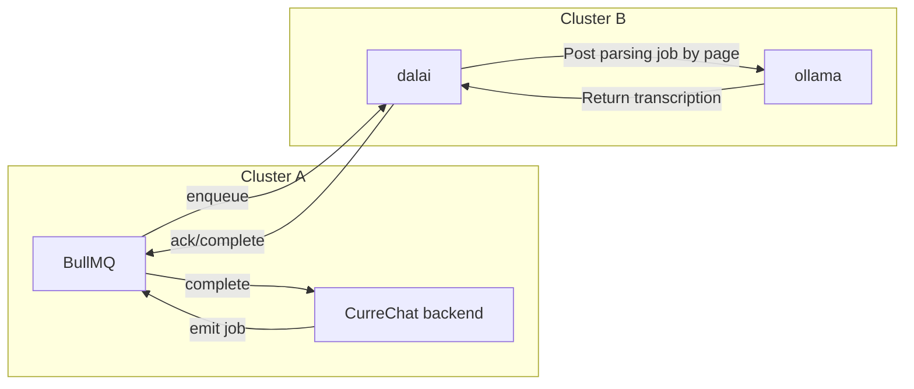

```mermaid
flowchart LR
  subgraph A[Cluster A]
    direction TB
    AQ[BullMQ]
    A1[CurreChat backend]
    A1 -->|emit job| AQ
    AQ -->|complete| A1
  end

  subgraph B[Cluster B]
    direction TB
    B1[dalai]
    B2[ollama]

    B1 -->|Post parsing job by page| B2
    B2 -->|Return transcription| B1
  end

  B1 -->|ack/complete| AQ
  AQ -->|enqueue| B1
```
