# Dalai VLLM Pipeline Architecture

This document visualizes the key pipelines in the gptwrapper/CurreChat system for embedding, chat completion, RAG, and PDF parsing.

## System Overview

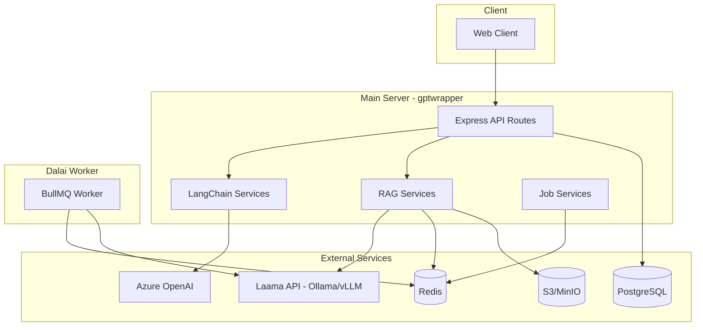

## 1. Chat Completion Pipeline

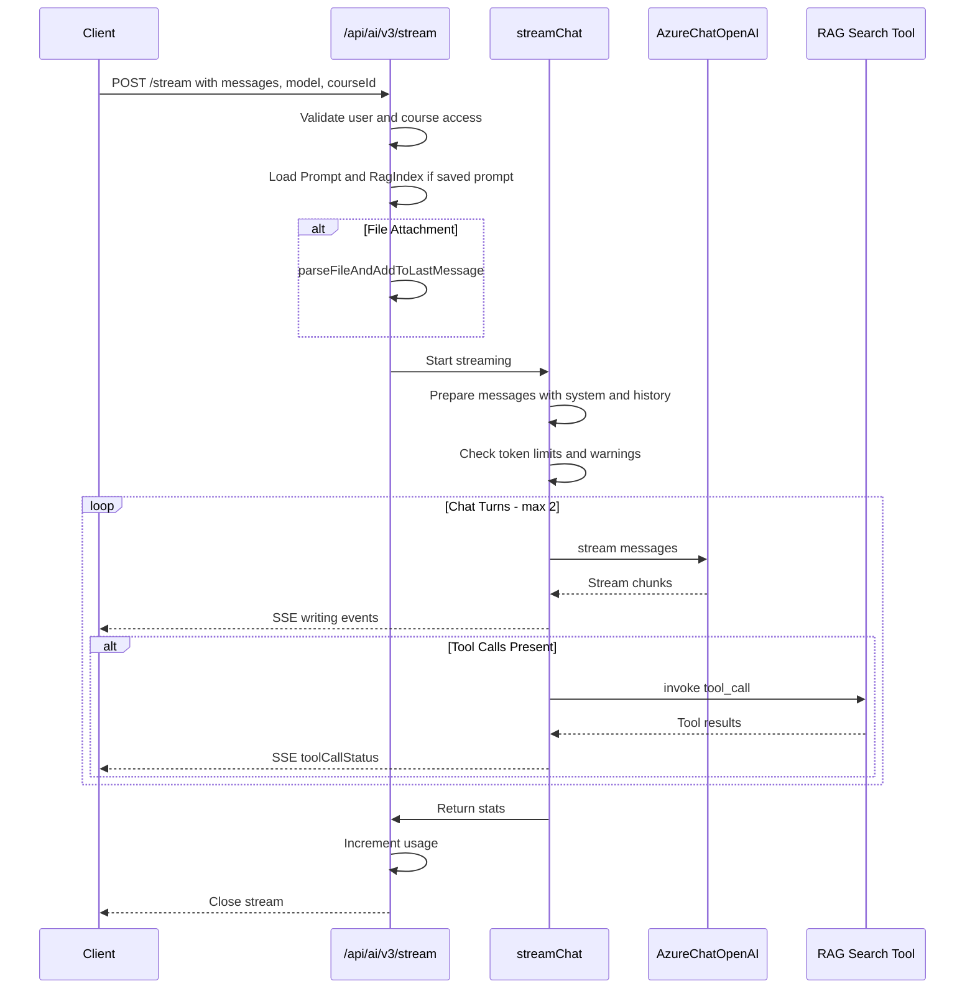

## 2. Embedding Pipeline

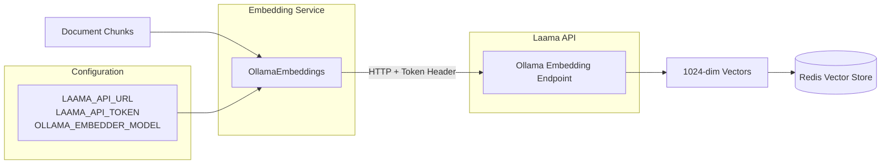

### Embedder Configuration

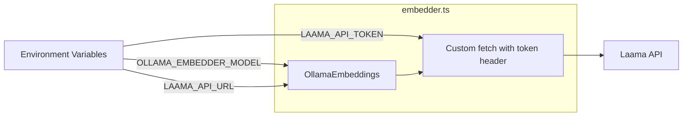

## 3. RAG Pipeline

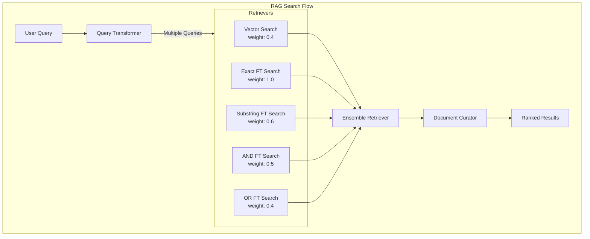

### RAG Ingestion Pipeline

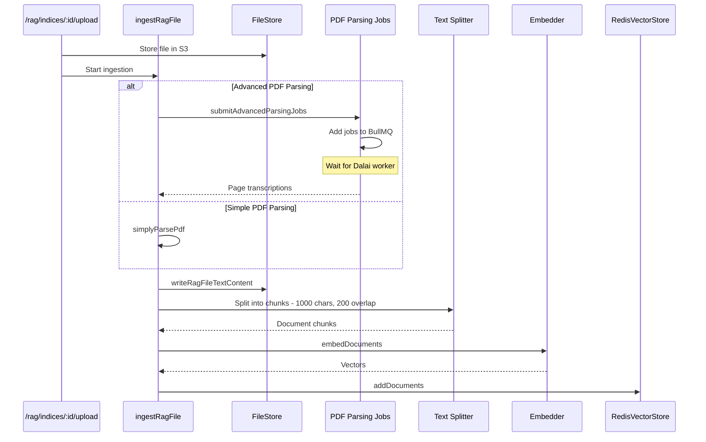

### RAG Tool Integration

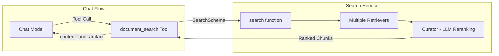

## 4. PDF Parsing Pipeline

### Simple PDF Parsing (in-process)

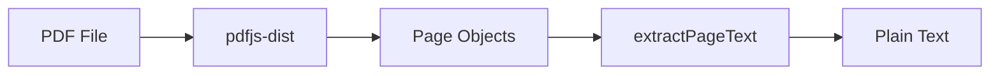

### Advanced PDF Parsing (Dalai Worker)

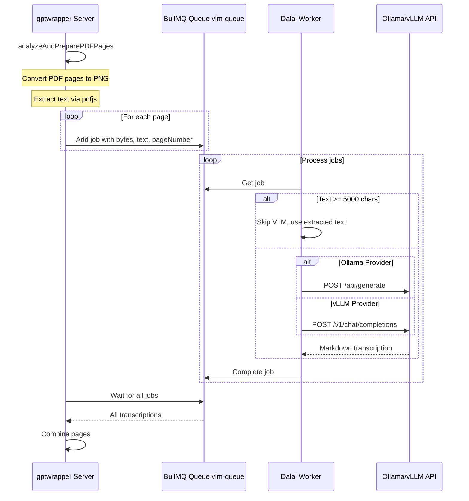

### Dalai Worker Architecture

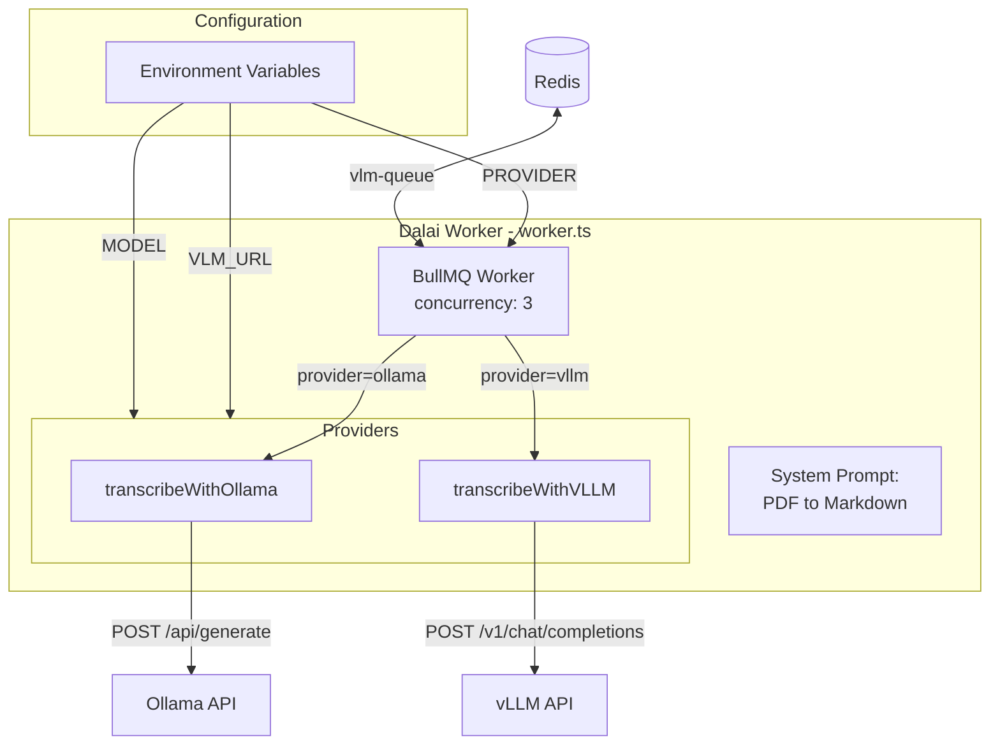

## 5. Vector Store Schema

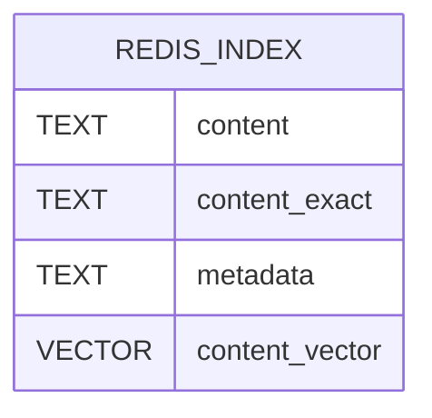

Note: `content_exact` has NOSTEM and WITHSUFFIXTRIE flags. `content_vector` uses HNSW algorithm with FLOAT32, DIM=1024, COSINE distance.

## 6. Complete Data Flow

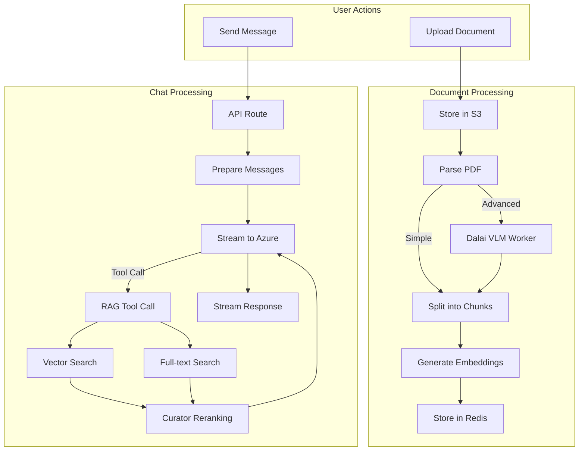

## Key Configuration

| Service        | Config Variable                         | Purpose                  |
| -------------- | --------------------------------------- | ------------------------ |
| Azure OpenAI   | `AZURE_API_KEY`, `AZURE_RESOURCE`       | Chat completions         |
| Laama/Ollama   | `LAAMA_API_URL`, `LAAMA_API_TOKEN`      | Embeddings               |
| Embedder Model | `OLLAMA_EMBEDDER_MODEL`                 | Embedding model name     |
| S3 Storage     | `S3_HOST`, `S3_BUCKET`, `S3_ACCESS_KEY` | Document storage         |
| Redis          | `REDIS_HOST`, `REDIS_PORT`              | Vector store & job queue |
| BullMQ Redis   | `BMQ_REDIS_HOST`, `BMQ_REDIS_PORT`      | Job queue connection     |
| Dalai VLM      | `VLM_URL`, `MODEL`, `PROVIDER`          | Vision language model    |

## File Structure

```
src/server/
├── routes/
│   ├── ai/
│   │   ├── v3.ts           # Chat completion endpoint
│   │   └── fileParsing.ts  # File parsing utilities
│   └── rag/
│       ├── rag.ts          # RAG index CRUD
│       └── ragIndex.ts     # File upload & search
├── services/
│   ├── langchain/
│   │   ├── azure.ts        # Azure OpenAI client
│   │   └── chat.ts         # Chat streaming logic
│   ├── rag/
│   │   ├── embedder.ts     # Ollama embeddings
│   │   ├── ingestion.ts    # Document ingestion
│   │   ├── search.ts       # Search orchestration
│   │   ├── retrievers.ts   # Various retriever types
│   │   ├── vectorStore.ts  # Redis vector store
│   │   └── searchTool.ts   # LangChain tool wrapper
│   └── jobs/
│       └── pdfParsing.job.ts  # PDF job submission

dalai/
├── worker.ts               # BullMQ worker for VLM transcription
└── README.md
```
